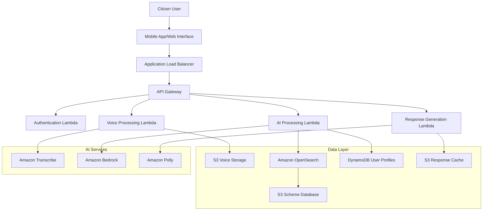

# Design Document: SetuAI

## Overview

SetuAI is a voice-first multilingual AI agent designed to democratize access to government schemes for Indian citizens. The system leverages AWS cloud services to provide a scalable, accessible, and intelligent interface that supports regional languages and operates efficiently on low-bandwidth connections.

The architecture follows a serverless, event-driven design using AWS Lambda functions orchestrated through API Gateway, with Amazon Bedrock providing AI capabilities, Amazon OpenSearch enabling RAG-based contextual responses, and Amazon Polly delivering natural-sounding voice output in multiple Indian languages.

## Architecture

### High-Level Architecture


## 2. Technical Stack
- **AI Brain:** Amazon Bedrock (Claude 3.5 Sonnet) – Handles multi-lingual reasoning and intent detection.
- **Retrieval Engine:** Amazon OpenSearch Serverless – Powers the RAG pipeline.
- **Orchestration:** AWS Lambda – Coordinates requests between the user and the AI models.

### Component Architecture

The system is composed of four main processing layers:

1. **Interface Layer**: Handles user interactions and protocol management
2. **Processing Layer**: Manages voice processing, AI inference, and response generation
3. **Data Layer**: Stores user profiles, scheme information, and cached responses
4. **AI Services Layer**: Provides speech recognition, natural language processing, and speech synthesis

## Components and Interfaces

## 2. Technical Stack

### 2.1 Cloud Infrastructure (AWS)
- **Orchestration:** **AWS Lambda** (Python 3.12) - Handles serverless backend logic and API requests.
- **AI Brain:** **Amazon Bedrock (Claude 3.5 Sonnet)** - Manages multi-lingual reasoning and response generation.
- **Vector Database:** **Amazon OpenSearch Serverless** - Powers the RAG (Retrieval-Augmented Generation) system for government scheme data.
- **Voice Ears:** **Amazon Transcribe** - Converts regional Indian dialects into text.
- **Voice Speech:** **Amazon Polly** - Converts text into natural regional language speech.
- **Storage:** **Amazon S3** - Stores PDF documents and processed audio files.

### 2.2 Frontend & Interface
- **Framework:** React.js / Next.js (for web) or WhatsApp Business API (for mobile accessibility).
- **Communication:** WebSockets (via AWS API Gateway) for real-time voice streaming.### 1. Voice Processing Service

**Purpose**: Handles speech-to-text conversion and audio optimization for low-bandwidth scenarios.

**Key Components**:
- **Audio Preprocessor**: Noise reduction and audio quality enhancement
- **Language Detector**: Identifies spoken language from audio input
- **Transcription Engine**: Converts speech to text using Amazon Transcribe
- **Bandwidth Optimizer**: Compresses audio for low-bandwidth connections

**Interfaces**:
```typescript
interface VoiceProcessingService {
  processAudioInput(audioData: Buffer, userId: string): Promise<TranscriptionResult>
  detectLanguage(audioData: Buffer): Promise<LanguageCode>
  optimizeForBandwidth(audioData: Buffer, bandwidthKbps: number): Promise<Buffer>
}

interface TranscriptionResult {
  text: string
  confidence: number
  language: LanguageCode
  duration: number
}
```

### 2. AI Processing Service

**Purpose**: Processes user queries using AWS Bedrock and retrieves relevant context using RAG.

**Key Components**:
- **Query Processor**: Analyzes user intent and extracts key information
- **RAG Engine**: Retrieves relevant scheme information using Amazon OpenSearch
- **Bedrock Interface**: Manages interactions with AWS Bedrock models
- **Context Manager**: Maintains conversation context and user preferences

**Interfaces**:
```typescript
interface AIProcessingService {
  processQuery(query: string, userId: string, language: LanguageCode): Promise<AIResponse>
  retrieveSchemeContext(query: string, userProfile: UserProfile): Promise<SchemeContext[]>
  generateResponse(query: string, context: SchemeContext[], language: LanguageCode): Promise<string>
}

interface AIResponse {
  response: string
  confidence: number
  schemes: SchemeRecommendation[]
  followUpQuestions: string[]
}
```

### 3. Response Generation Service

**Purpose**: Converts AI-generated text responses to natural speech using Amazon Polly.

**Key Components**:
- **Text Processor**: Formats and optimizes text for speech synthesis
- **Voice Synthesizer**: Generates natural-sounding speech using Amazon Polly
- **Regional Adapter**: Adapts pronunciation and intonation for regional preferences
- **Audio Optimizer**: Compresses audio output for bandwidth constraints

**Interfaces**:
```typescript
interface ResponseGenerationService {
  generateVoiceResponse(text: string, language: LanguageCode, userId: string): Promise<AudioResponse>
  adaptToRegionalPreferences(text: string, region: string): Promise<string>
  optimizeAudioOutput(audioData: Buffer, targetBandwidth: number): Promise<Buffer>
}

interface AudioResponse {
  audioData: Buffer
  duration: number
  format: AudioFormat
  size: number
}
```

### 4. Scheme Information Service

**Purpose**: Manages government scheme data and provides intelligent search capabilities.

**Key Components**:
- **Scheme Database Manager**: Maintains up-to-date scheme information
- **Eligibility Engine**: Assesses user eligibility for various schemes
- **Search Engine**: Provides semantic search using Amazon OpenSearch
- **Update Synchronizer**: Keeps scheme data synchronized with government sources

**Interfaces**:
```typescript
interface SchemeInformationService {
  searchSchemes(query: string, userProfile: UserProfile): Promise<SchemeResult[]>
  assessEligibility(schemeId: string, userProfile: UserProfile): Promise<EligibilityResult>
  getSchemeDetails(schemeId: string, language: LanguageCode): Promise<SchemeDetails>
  updateSchemeDatabase(): Promise<UpdateResult>
}

interface SchemeResult {
  schemeId: string
  name: string
  description: string
  eligibilityScore: number
  benefits: string[]
  applicationDeadline?: Date
}
```

## Data Models

### User Profile
```typescript
interface UserProfile {
  userId: string
  preferredLanguage: LanguageCode
  region: string
  demographics: {
    age?: number
    gender?: string
    occupation?: string
    income?: IncomeRange
    familySize?: number
  }
  preferences: {
    voiceSpeed: number
    audioQuality: AudioQuality
    bandwidthMode: BandwidthMode
  }
  interactionHistory: InteractionRecord[]
}
```

### Scheme Information
```typescript
interface SchemeDetails {
  schemeId: string
  name: Record<LanguageCode, string>
  description: Record<LanguageCode, string>
  eligibilityCriteria: EligibilityCriteria[]
  benefits: Record<LanguageCode, string[]>
  applicationProcess: Record<LanguageCode, ApplicationStep[]>
  requiredDocuments: Record<LanguageCode, string[]>
  deadlines: {
    applicationStart?: Date
    applicationEnd?: Date
    benefitDistribution?: Date
  }
  governmentLevel: 'central' | 'state' | 'local'
  category: SchemeCategory
}
```

### Conversation Context
```typescript
interface ConversationContext {
  sessionId: string
  userId: string
  language: LanguageCode
  currentTopic: string
  previousQueries: string[]
  mentionedSchemes: string[]
  userIntent: IntentType
  contextualInformation: Record<string, any>
  timestamp: Date
}
```

## Data Flow

### Voice Query Processing Flow

1. **Audio Input**: User speaks query in regional language
2. **Preprocessing**: Audio is cleaned, normalized, and optimized for bandwidth
3. **Language Detection**: System identifies spoken language
4. **Transcription**: Amazon Transcribe converts speech to text
5. **Query Processing**: AI processes text query and extracts intent
6. **Context Retrieval**: RAG system retrieves relevant scheme information
7. **Response Generation**: AWS Bedrock generates contextual response
8. **Voice Synthesis**: Amazon Polly converts response to speech
9. **Audio Delivery**: Optimized audio is delivered to user

### RAG-Enhanced Information Retrieval

1. **Query Analysis**: User query is analyzed for intent and entities
2. **Vector Search**: Query is converted to embeddings and searched in OpenSearch
3. **Context Ranking**: Retrieved documents are ranked by relevance
4. **Context Injection**: Top-ranked context is injected into Bedrock prompt
5. **Response Generation**: Bedrock generates response using retrieved context
6. **Fact Verification**: Response is validated against scheme database
7. **Language Adaptation**: Response is adapted to user's preferred language

### Low-Bandwidth Optimization Flow

1. **Bandwidth Detection**: System detects available bandwidth
2. **Mode Selection**: Appropriate optimization mode is selected
3. **Audio Compression**: Input/output audio is compressed accordingly
4. **Caching Strategy**: Frequently accessed content is cached locally
5. **Progressive Loading**: Large responses are delivered in chunks
6. **Fallback Handling**: System gracefully handles connection issues

## Correctness Properties

*A property is a characteristic or behavior that should hold true across all valid executions of a system-essentially, a formal statement about what the system should do. Properties serve as the bridge between human-readable specifications and machine-verifiable correctness guarantees.*

### Property 1: Speech Recognition Accuracy
*For any* supported regional language audio input under 30 seconds, the Voice_Interface should achieve at least 85% transcription accuracy and complete processing within 3 seconds
**Validates: Requirements 1.1, 1.2**

### Property 2: Multilingual Response Consistency  
*For any* user query in a supported regional language, the AI_Engine should respond in the same language with personalized content based on user profile
**Validates: Requirements 2.2, 4.3, 7.3**

### Property 3: Low-Bandwidth Operation
*For any* network connection below 64 kbps, the system should automatically enable Low_Bandwidth_Mode, compress audio by at least 70%, and complete basic queries using less than 100KB data transfer
**Validates: Requirements 3.1, 3.2, 3.5**

### Property 4: Noise Filtering and Speaker Prioritization
*For any* audio input with background noise or multiple speakers, the Voice_Interface should filter ambient noise and prioritize the primary speaker's voice
**Validates: Requirements 1.3, 1.4**

### Property 5: RAG-Enhanced Information Retrieval
*For any* government scheme query, the RAG_System should retrieve relevant context from OpenSearch and generate accurate responses based on the latest available data
**Validates: Requirements 4.1, 4.2**

### Property 6: Structured Response Generation
*For any* complex scheme information or application process query, the AI_Engine should break down responses into digestible parts with step-by-step guidance and required documents
**Validates: Requirements 4.4, 4.5**

### Property 7: Performance Under Load
*For any* system load condition, the SetuAI_System should respond within 5 seconds for 95% of requests, maintain sub-10-second response times under high load, and support at least 10,000 concurrent users
**Validates: Requirements 9.1, 9.2, 9.3**

### Property 8: Comprehensive Error Handling
*For any* error condition (poor audio quality, service failures, uncertain language detection), the system should provide appropriate user feedback in simple, non-technical language and gracefully handle failures
**Validates: Requirements 1.5, 2.3, 6.2, 9.4**

### Property 9: Data Privacy and Security
*For any* personal information collected, the system should encrypt data in transit and at rest, delete voice recordings after processing, store only necessary information, and honor deletion requests within 30 days
**Validates: Requirements 8.1, 8.2, 8.3, 8.4**
- **Amazon Bedrock Guardrails:** THE SetuAI_System SHALL implement guardrails to monitor both incoming user prompts and outgoing AI responses.
- **Hallucination Prevention:** THE system SHALL use "Contextual Grounding" to filter model responses that are not grounded in official government data.
- **PII Masking:** THE Guardrail SHALL automatically redact sensitive Personally Identifiable Information (PII) like Aadhaar or phone numbers before processing.
- **Denied Topics:** THE system SHALL block restricted topics, such as unauthorized financial or legal advice, to maintain safety.

### Property 10: Hands-Free Voice Operation
*For any* user interaction, the system should support complete hands-free operation without requiring text input, provide voice-guided instructions, and allow interruption of lengthy responses
**Validates: Requirements 5.4, 6.1, 6.5**

### Property 11: Scheme Database Completeness and Timeliness
*For any* government scheme in the database, it should contain complete information (eligibility, benefits, application procedures) and reflect updates within 24 hours
**Validates: Requirements 7.1, 7.2**

### Property 12: Proactive Scheme Recommendations
*For any* user profile with multiple relevant schemes, the system should prioritize recommendations based on user needs and proactively inform about approaching deadlines
**Validates: Requirements 7.4, 7.5**

### Property 13: Automatic Scaling and Synchronization
*For any* demand spike or government database update, the system should automatically scale resources to maintain performance and synchronize scheme information
**Validates: Requirements 9.5, 10.4, 10.5**

## Error Handling

### Voice Processing Errors
- **Audio Quality Issues**: When audio quality is insufficient for reliable transcription, the system requests user to repeat the query with specific guidance
- **Language Detection Failures**: When language detection confidence is below threshold, the system asks user to specify their preferred language
- **Transcription Timeouts**: When transcription exceeds time limits, the system provides fallback options including text input

### AI Processing Errors  
- **Context Retrieval Failures**: When OpenSearch is unavailable, the system falls back to cached scheme information with appropriate user notification
- **Bedrock Service Errors**: When AWS Bedrock is unavailable, the system provides pre-generated responses for common queries
- **Response Generation Timeouts**: When AI response generation exceeds limits, the system provides structured fallback responses

### Network and Bandwidth Errors
- **Connection Failures**: When network connectivity is lost, the system operates in offline mode using cached data
- **Bandwidth Degradation**: When bandwidth drops below operational thresholds, the system automatically adjusts compression and caching strategies
- **Service Unavailability**: When AWS services are unavailable, the system provides graceful degradation with clear user communication

### Data and Security Errors
- **Encryption Failures**: When encryption operations fail, the system refuses to process sensitive data and notifies administrators
- **Data Corruption**: When stored data integrity checks fail, the system initiates data recovery procedures
- **Privacy Violations**: When data handling violates privacy requirements, the system logs incidents and initiates corrective actions

## Testing Strategy

### Dual Testing Approach

The SetuAI system requires comprehensive testing using both unit tests and property-based tests to ensure correctness across the diverse range of inputs and scenarios.

**Unit Testing Focus**:
- Specific examples of voice inputs in each supported language
- Edge cases for audio quality and background noise scenarios  
- Integration points between AWS services (Bedrock, Polly, OpenSearch, Transcribe)
- Error conditions and fallback mechanisms
- Specific government scheme data validation
- Security and privacy compliance verification

**Property-Based Testing Focus**:
- Universal properties that hold across all supported languages and user inputs
- Performance characteristics under varying load and network conditions
- Data privacy and security properties across all user interactions
- Voice processing accuracy across diverse audio inputs
- AI response quality and consistency properties
- Bandwidth optimization effectiveness across connection types

**Property-Based Testing Configuration**:
- Minimum 100 iterations per property test to account for randomization
- Each property test references its corresponding design document property
- Tag format: **Feature: setu-ai, Property {number}: {property_text}**
- Tests use appropriate generators for:
  - Multi-language audio samples with varying quality and background noise
  - Diverse user profiles representing Indian demographics
  - Government scheme data with different complexity levels
  - Network conditions simulating rural connectivity scenarios
  - Load patterns representing realistic usage spikes

**Testing Libraries and Tools**:
- **JavaScript/TypeScript**: fast-check for property-based testing, Jest for unit testing
- **Python**: Hypothesis for property-based testing, pytest for unit testing  
- **Audio Testing**: Custom generators for multi-language speech samples with controlled noise and quality variations
- **AWS Service Mocking**: LocalStack for local AWS service simulation during testing
- **Performance Testing**: Artillery or similar tools for load testing and scalability validation

**Integration Testing Strategy**:
- End-to-end voice interaction flows in multiple languages
- AWS service integration testing with actual service calls
- Cross-service data flow validation (voice → AI → response pipeline)
- Security and privacy compliance testing across all data handling paths
- Performance testing under simulated rural network conditions